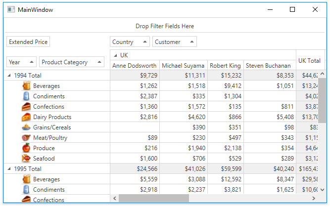

<!-- default badges list -->

<!-- default badges end -->
# Pivot Grid for WPF - How to Create a Field Value Template

This example shows how to define a custom template used to display field values. The template in this example displays field values with images, as shown in the picture below.

## Files to Review 

* [MainWindow.xaml.cs](./CS/HowToCreateFieldValueTemplate/MainWindow.xaml.cs) / [MainWindow.xaml.vb](./VB/HowToCreateFieldValueTemplate/MainWindow.xaml.vb)

* [MainWindow.xaml](./CS/HowToCreateFieldValueTemplate/MainWindow.xaml) / [MainWindow.xaml](./VB/HowToCreateFieldValueTemplate/MainWindow.xaml)

## Documentation

- [Pivot Grid - Appearance](https://docs.devexpress.com/WPF/8399/controls-and-libraries/pivot-grid/appearance)

## More Examples

- [Pivot Grid for WPF - How to Edit a Cell with the Cell Editing Template](https://github.com/DevExpress-Examples/how-to-define-a-custom-cell-template-that-allows-performing-data-editing-t410760)
